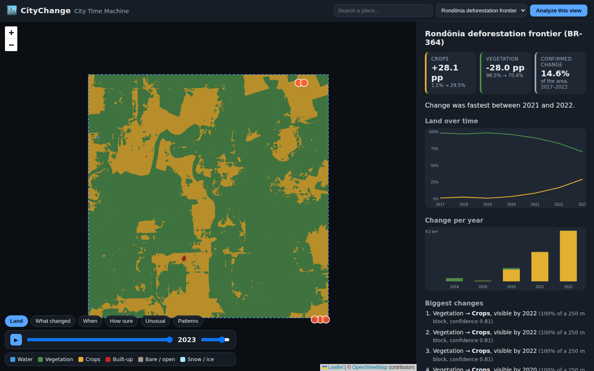

# CityChange

**Urban evolution intelligence from open Earth-observation data.**

Google Maps shows what a place looks like. CityChange tells the story of
how it became what it is — *git history for physical places*. Pick any
area on the map and CityChange reconstructs its 2017–2023 land history
from open satellite-derived observations: what changed, when, along which
trajectory, how unusual that trajectory is, and how strong the evidence
is — with inspectable before/after imagery.

**Status: v1.0** — full pineline, 6-region validation benchmark, web app,
API, evaluation suite. Built as a year-long academic project.



## What it does

For any in-coverage bounding box (≤ ~1500 km²), CityChange:

1. streams annual 10 m land-cover observations (2017–2023) via windowed
   reads of public cloud-optimized GeoTIFFs — a few MB per region, no
   credentials, cached for offline re-runs;
2. converts them to canonical land states (built / vegetation / crops /
   water / bare / snow) — the analysis never depends on one product's
   class scheme;
3. extracts **dated change events** (two-phase model: a persistent new
   state replacing a stable predecessor, ±1 year timing);
4. models **trajectories** — run-length signatures and interpretable
   archetypes (stable, direct change, staged change, reverted,
   fluctuating…);
5. finds **patterns** (blocks that evolved similarly, via k-means) and
   **anomalies** (statistically rare trajectories under a strict area
   budget — rare means uncommon, never "illicit");
6. grades every detected change with an **evidence score** (persistence,
   pre-stability, sequence purity, spatial support), validated by
   temporal holdout;
7. fetches Sentinel-2 **before/after chips** so claims can be verified by
   eye;
8. renders it all as a grounded story: no free-text generation, no causal
   claims, explicit caveats.

## Quickstart

```bash
python -m venv .venv && source .venv/bin/activate
pip install -e ".[dev]"

pytest                                   # 61 tests, no network needed
citychange run configs/devanahalli.yaml  # pilot region (~1 min first run)
citychange benchmark                     # all 6 validation regions
citychange serve                         # City Time Machine → :8000
```

Or any place you like:

```bash
citychange run --bbox 77.63 13.17 77.73 13.27 --name my_area
```

Docker: see [docs/DEPLOY.md](docs/DEPLOY.md).

## Does it generalize? (measured, not claimed)

One global parameter set, six regions, four continents
([docs/EVALUATION.md](docs/EVALUATION.md)):

| region | regime | persistent change |
|---|---|---|
| Devanahalli (IN) | rapid urbanization | 26.6% (built +19.4 pp) |
| Frisco (US) | suburban expansion | 14.9% (built +10.6 pp) |
| Rondônia (BR) | deforestation frontier | 14.6% (crops +28.1 pp) |
| Lake Mead (US) | water dynamics | 8.4% |
| Ansbach (DE) | stable rural control | 2.3% |
| central Paris (FR) | dense stable control | 0.2% |

Stable places read as stable — as important as detecting drama.
Confidence scores are holdout-validated (highest-evidence quartile is
20–41 pp more likely to persist than the lowest in settlement regimes;
known failure mode at active frontiers is documented, not hidden).

## Repository layout

```
citychange/          pipeline + intelligence layer + API (production code)
frontend/            City Time Machine (no build step, vendored Leaflet)
configs/             region definitions; configs/benchmark/ = validation suite
tests/               61 unit/API tests (synthetic data, no network)
docs/                architecture, decisions, data sources, evaluation,
                     experiments, deployment, reproduction
reports/             academic report material
docker/              Dockerfile + compose
data/                gitignored: caches + analysis bundles
```

## Documentation

| doc | contents |
|---|---|
| [CITYCHANGE_FINAL_PLAN.md](CITYCHANGE_FINAL_PLAN.md) | execution plan + definition of done |
| [docs/ARCHITECTURE.md](docs/ARCHITECTURE.md) | system design + invariants |
| [docs/DECISIONS.md](docs/DECISIONS.md) | decision log D-001…D-013 |
| [docs/DATA_SOURCES.md](docs/DATA_SOURCES.md) | verified sources, licenses, limits |
| [docs/EVALUATION.md](docs/EVALUATION.md) | benchmark, validation, honest failures |
| [docs/EXPERIMENTS.md](docs/EXPERIMENTS.md) | experiment log E-001…E-005 |
| [docs/REPRODUCE.md](docs/REPRODUCE.md) | one command per result |
| [docs/DEPLOY.md](docs/DEPLOY.md) | local + Docker deployment |

## License & attribution

Code MIT. Data: Impact Observatory / Microsoft / Esri 10 m Annual LULC
(CC BY 4.0, from ESA Sentinel-2); ESA WorldCover (CC BY 4.0); Copernicus
Sentinel-2 imagery (ESA); geocoding & basemap © OpenStreetMap
contributors.
